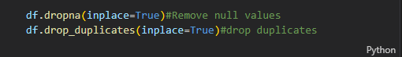
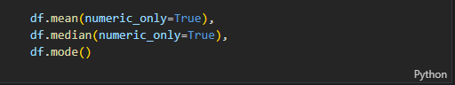
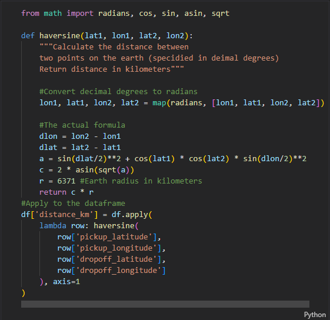
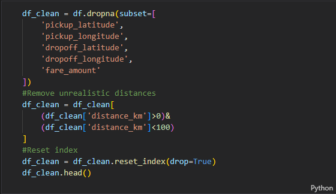
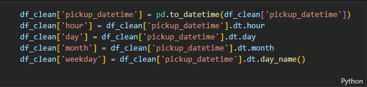
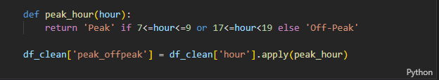

# 🚖 Uber Fares Dataset Analysis — Power BI Project

**Course:** INSY 8413 — Introduction to Big Data Analytics  
**Instructor:** Eric Maniraguha (eric.maniraguha@auca.ac.rw)  
**Student:** SHUMBUSHO UMUTONI Daniel ID-24843
**Date:** July 2025

---

## 📌 Project Overview

This project analyzes the **Uber Fares Dataset** to gain insights into fare patterns, ride durations, peak periods, and other operational metrics. The analysis process combines **Python (Pandas, EDA)** for data preparation and **Power BI** for advanced interactive visualizations.

---

## 🎯 Objectives

- Understand the dataset structure and clean the raw data.
- Perform exploratory data analysis (EDA) in Python.
- Engineer new time-based features for deeper insights.using Power BI.
- Deliver an interactive, professional dashboard.
- Summarize findings and provide business recommendations.

---

## 🗂️ Dataset

- **Source:** [Uber Fares Dataset on Kaggle](https://www.kaggle.com/datasets/yasserh/uber-fares-dataset)
- **Contents:** Uber ride data including fare amount, distance, timestamps, and location coordinates.

---

## ⚙️ Tools & Technologies

- **Python:** For EDA and data cleaning (`pandas`, `numpy`, `seaborn`, `matplotlib`).
- **Power BI Desktop:** For creating interactive visual dashboards.
- **GitHub:** For version control and project documentation.

---

## 🔍 Methodology

### 1️⃣ Data Loading & Initial Exploration

- Loaded raw CSV data into a Pandas DataFrame.
  
- Checked dataset dimensions, column data types, and missing values.
- Verified data quality and identified inconsistencies.
  

### 2️⃣ Data Cleaning

- Removed missing values.
- Dropped duplicate records.
  

### 3️⃣ Exploratory Data Analysis (EDA)

- Generated descriptive statistics: mean, median, mode, quartiles.
- Visualized fare amount distributions and outliers.
  
  

### 4️⃣ Feature Engineering

-Convertion from coordinates to distance in kilometers using the Haversine formula and applying it to the dataset

-Remove empty values from coordinates to avoid biased results
-Ignore unrealistic distances

- Extracted **hour**, **day**, **month**, and **weekday** from ride timestamps.
  
- Created **peak/off-peak** time indicators based on ride hours.
  

### 5️⃣ Export for Power BI

- Saved the cleaned and enhanced dataset as a CSV for easy Power BI import.
  

### 6️⃣ Power BI Dashboard Development

- Imported the enhanced dataset.
- Designed visuals:
  - **Histogram:** Fare amount distribution.
  - **Scatter Plot:** Fare vs. Distance.
  - **Line Charts:** Fares by hour, day, and month.
  - **Matrix:** Rides by day of week and hour.
- Added interactive **Slicers** for filtering by:

  - Day of week
  - Hour of day
  - Month
  - Peak/off-peak

- Ensured the dashboard uses consistent colors, clear titles, and intuitive layout.

---

## 📊 Key Findings

- Most fares cluster within a certain range, with a few high-cost outliers.
- Clear correlation between distance traveled and fare amount.
- Peak fare hours align with typical commuting times.
- Weekdays from Monday to Friday show higher ride volumes during working hours than weekends. And the later shows higher rides volumes during midnight

---

## ✅ Recommendations

- **Peak Pricing:** Focus marketing strategies during peak ride times.
- **Operational Efficiency:** Optimize driver allocation for high-demand hours.
- **Customer Offers:** Consider fare discounts during off-peak times to balance demand.
